# Our-Twinkling-Infinitely

#### Flow Chart

1. 회원가입
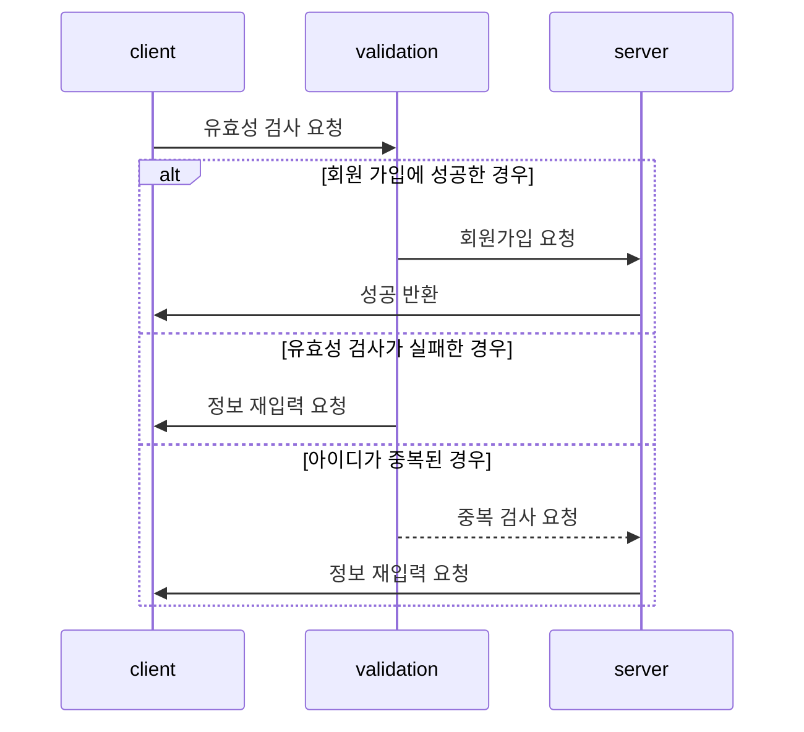
```mermaid
  sequenceDiagram
    client ->> validation : 유효성 검사 요청

    alt 회원 가입에 성공한 경우
    validation ->> server : 회원가입 요청
    server ->> client: 성공 반환

    else 유효성 검사가 실패한 경우
    validation ->> client : 정보 재입력 요청
    
    else 아이디가 중복된 경우 
    validation -->> server : 중복 검사 요청
    server ->> client : 정보 재입력 요청
    end
```

2. 로그인
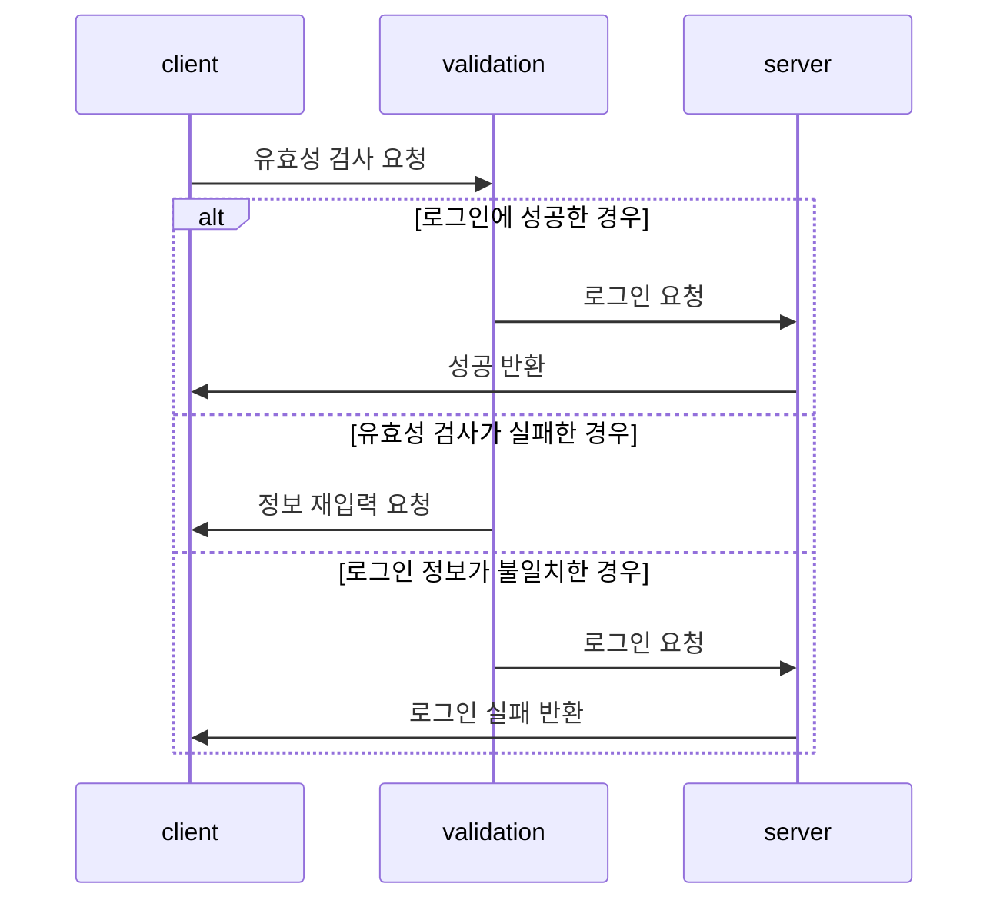
```mermaid
  sequenceDiagram
    client ->> validation : 유효성 검사 요청

    alt 로그인에 성공한 경우
    validation ->> server : 로그인 요청
    server ->> client: 성공 반환

    else 유효성 검사가 실패한 경우
    validation ->> client : 정보 재입력 요청

    else 로그인 정보가 불일치한 경우
    validation ->> server : 로그인 요청
    server ->> client : 로그인 실패 반환
    end
```

3. 회원정보 수정
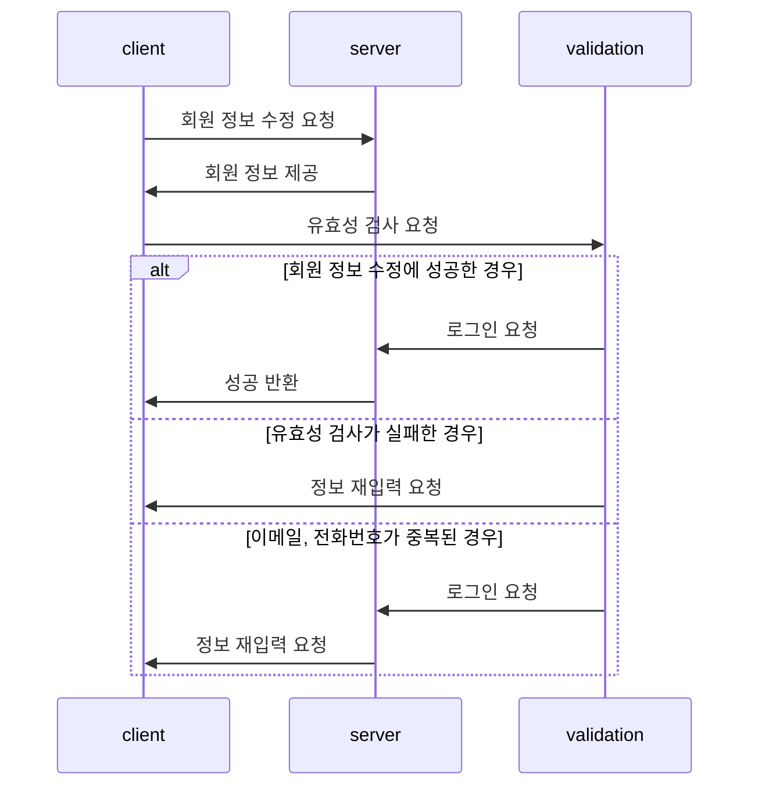
```mermaid
  sequenceDiagram
    client ->> server : 회원 정보 수정 요청
    server ->> client : 회원 정보 제공
    client ->> validation : 유효성 검사 요청

    alt 회원 정보 수정에 성공한 경우
    validation ->> server : 로그인 요청
    server ->> client : 성공 반환

    else 유효성 검사가 실패한 경우
    validation ->> client : 정보 재입력 요청

    else 이메일, 전화번호가 중복된 경우
    validation ->> server : 로그인 요청
    server ->> client : 정보 재입력 요청
    end
```

4. 회원 탈퇴
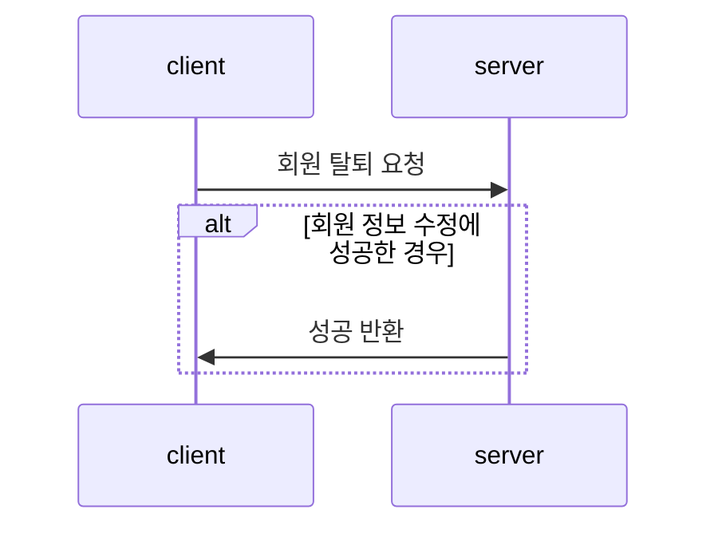
```mermaid
  sequenceDiagram
    client ->> server : 회원 탈퇴 요청
    alt 회원 정보 수정에 성공한 경우
    server ->> client : 성공 반환
    end
```

5. 검색 기능
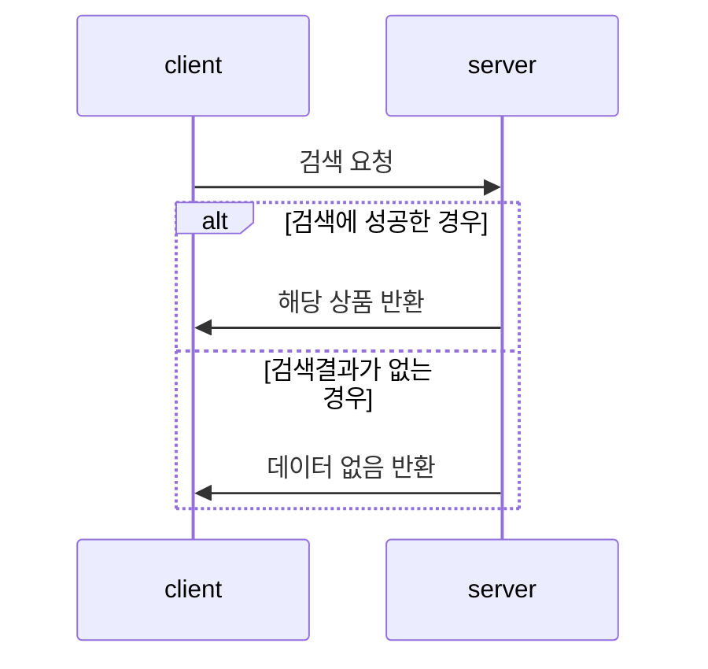
```mermaid
  sequenceDiagram
    client ->> server : 검색 요청
    alt 검색에 성공한 경우
    server ->> client : 해당 상품 반환

    else 검색결과가 없는 경우
    server ->> client : 데이터 없음 반환
    end
```

6. 상품 문의 작성하기
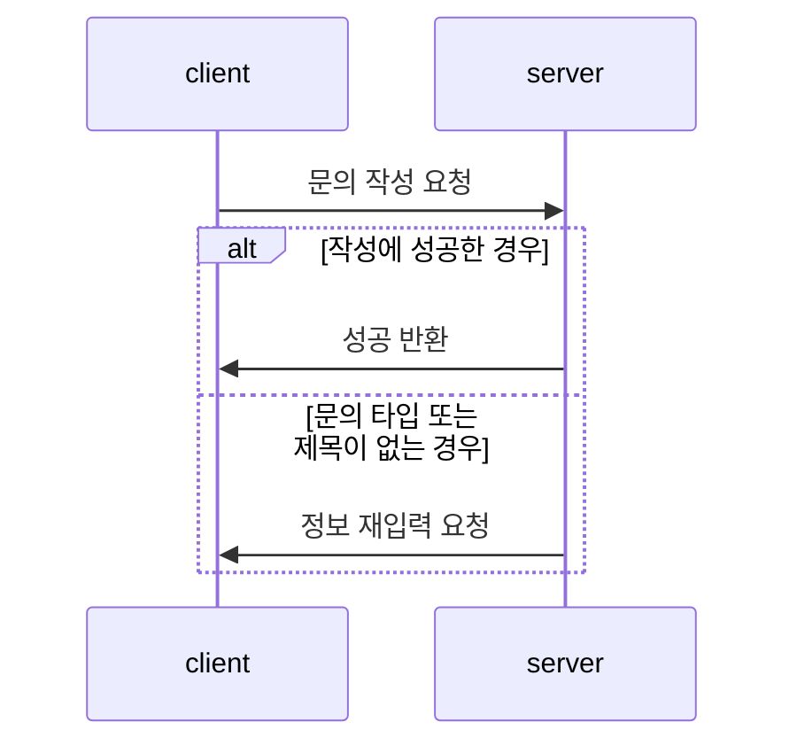
```mermaid
  sequenceDiagram
    client ->> server : 문의 작성 요청
    alt 작성에 성공한 경우
    server ->> client : 성공 반환

    else 문의 타입 또는 제목이 없는 경우
    server ->> client : 정보 재입력 요청
    end
```

7. 장바구니 담기
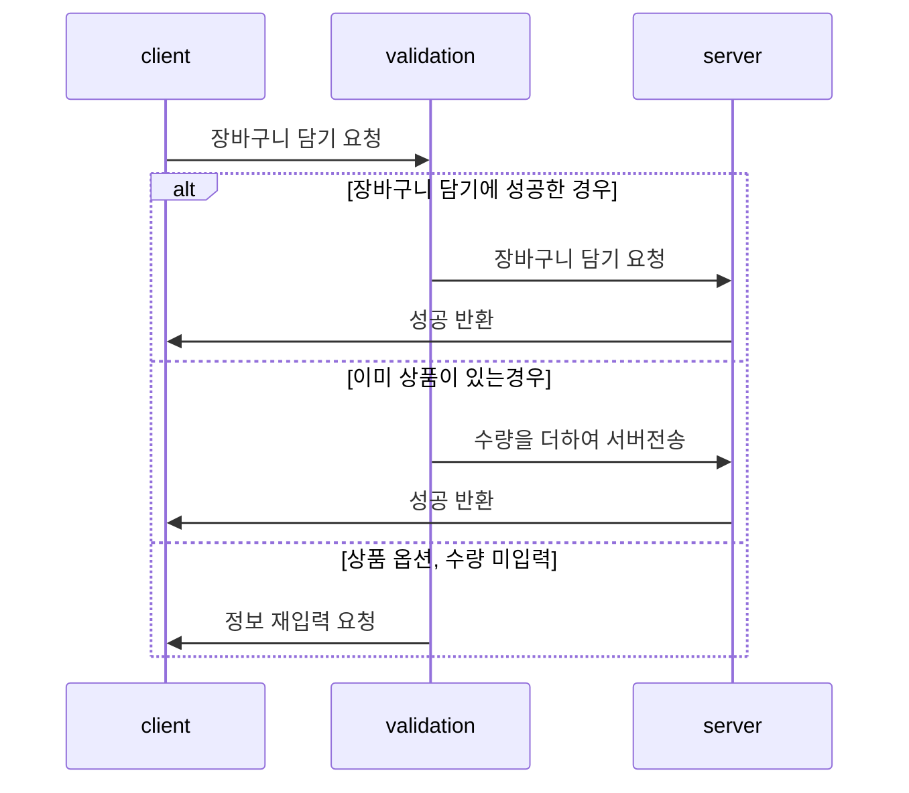
```mermaid
  sequenceDiagram
    client ->> validation : 장바구니 담기 요청

    alt 장바구니 담기에 성공한 경우
    validation ->> server : 장바구니 담기 요청
    server ->> client : 성공 반환

    else 이미 상품이 있는경우
    validation ->> server : 수량을 더하여 서버전송
    server ->> client : 성공 반환

    else 상품 옵션, 수량 미입력
    validation ->> client : 정보 재입력 요청
    end
```

8. 장바구니 수정/삭제하기
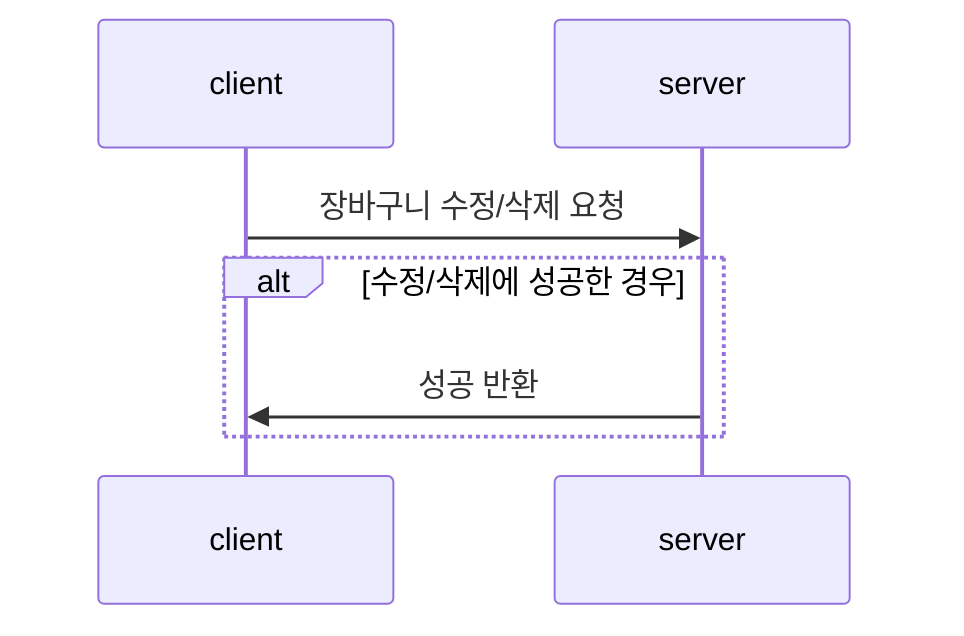
```mermaid
  sequenceDiagram
    client ->> server : 장바구니 수정/삭제 요청

    alt 수정/삭제에 성공한 경우
    server ->> client : 성공 반환
    end
```

9. 배송지 등록
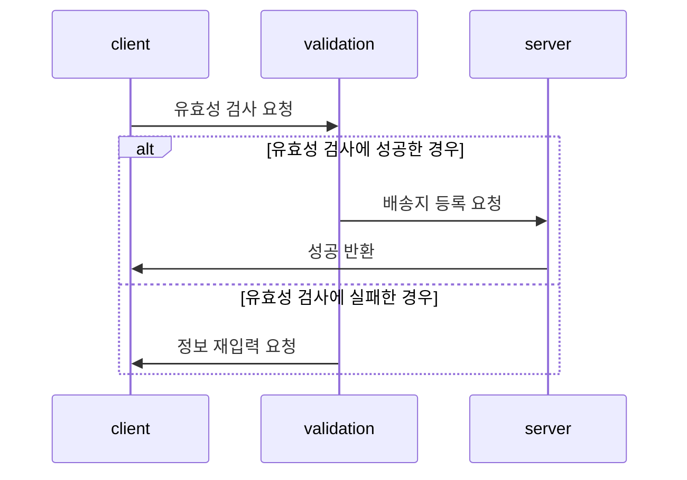
```mermaid
  sequenceDiagram
    client ->> validation : 유효성 검사 요청

    alt 유효성 검사에 성공한 경우
    validation ->> server : 배송지 등록 요청
    server ->> client : 성공 반환

    else 유효성 검사에 실패한 경우
    validation ->> client : 정보 재입력 요청
    end 
```

10. 배송지 수정

```mermaid
  sequenceDiagram
    client ->> validation : 유효성 검사 요청

    alt 유효성 검사에 성공한 경우
    validation ->> server : 배송지 등록 요청
    server ->> client : 성공 반환

    else 유효성 검사에 실패한 경우
    validation ->> client : 정보 재입력 요청
    end 
```

11. 배송지 삭제
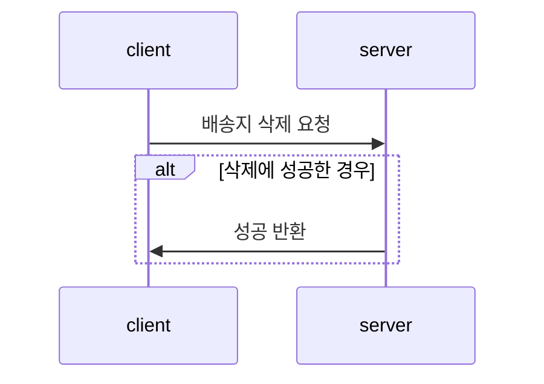
```mermaid
  sequenceDiagram
  client ->> server : 배송지 삭제 요청

  alt 삭제에 성공한 경우
  server ->> client : 성공 반환
  end 
```

12. 주문 결제
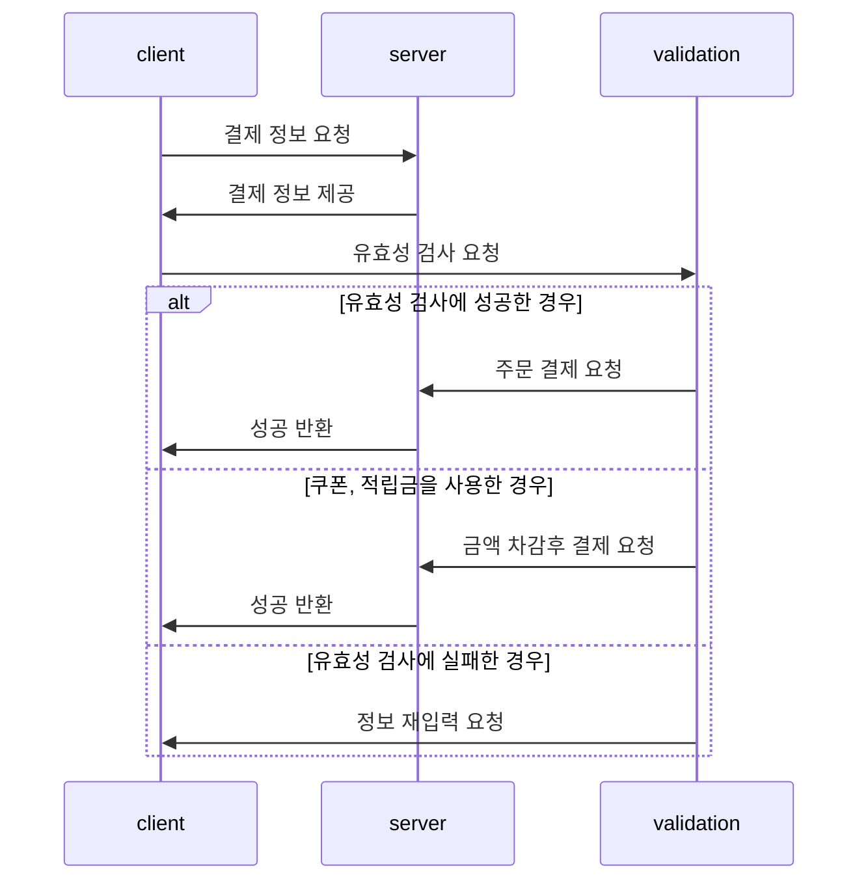
```mermaid
  sequenceDiagram
    client ->> server : 결제 정보 요청
    server ->> client : 결제 정보 제공
    client ->> validation : 유효성 검사 요청

    alt 유효성 검사에 성공한 경우
    validation ->> server : 주문 결제 요청
    server ->> client : 성공 반환

    else 쿠폰, 적립금을 사용한 경우
    validation ->> server : 금액 차감후 결제 요청
    server ->> client : 성공 반환

    else 유효성 검사에 실패한 경우
    validation ->> client : 정보 재입력 요청
    
    end 
```

13. 프로필 사진 변경
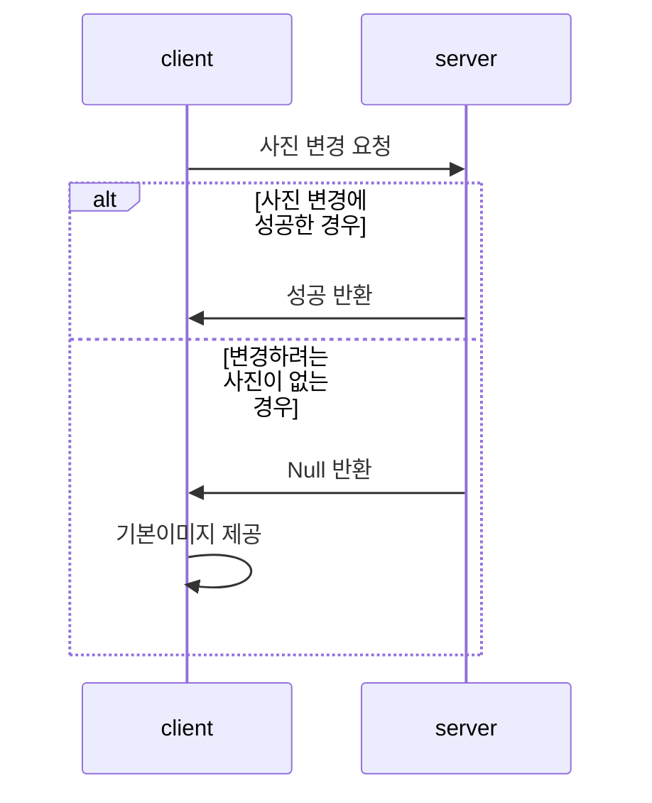
```mermaid
  sequenceDiagram
    client ->> server : 사진 변경 요청

    alt 사진 변경에 성공한 경우
    server ->> client : 성공 반환

    else 변경하려는 사진이 없는 경우
    server ->> client : Null 반환
    client ->> client : 기본이미지 제공
    
    end 
```

14. 리뷰 작성
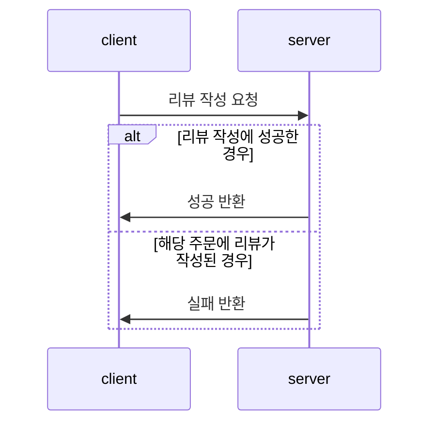
```mermaid
  sequenceDiagram
    client ->> server : 리뷰 작성 요청

    alt 리뷰 작성에 성공한 경우
    server ->> client : 성공 반환

    else 해당 주문에 리뷰가 작성된 경우
    server ->> client : 실패 반환

    end 
```

15. 리뷰 수정
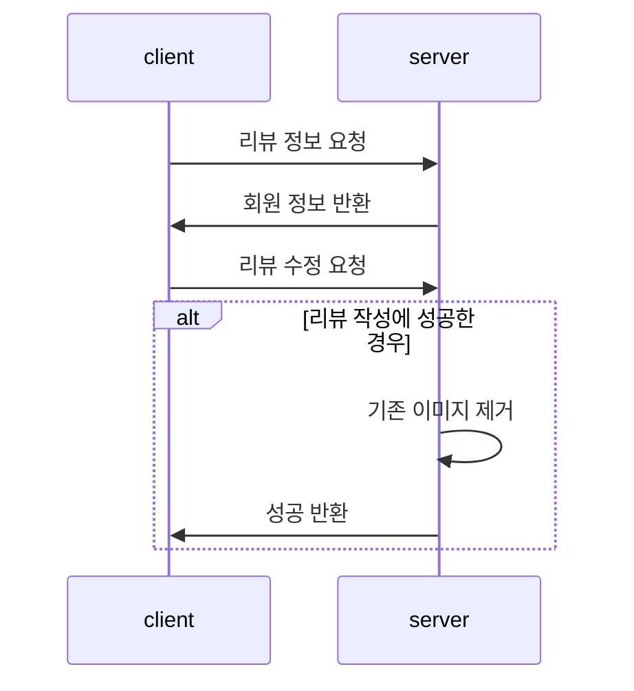
```mermaid
  sequenceDiagram
    client ->> server : 리뷰 정보 요청
    server ->> client : 회원 정보 반환
    client ->> server : 리뷰 수정 요청

    alt 리뷰 작성에 성공한 경우
    server ->> server : 기존 이미지 제거
    server ->> client : 성공 반환

    end 
```

16. 리뷰 삭제
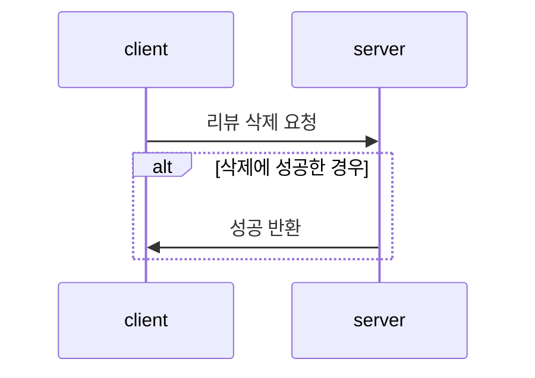
```mermaid
  sequenceDiagram
  client ->> server : 리뷰 삭제 요청

  alt 삭제에 성공한 경우
  server ->> client : 성공 반환
  end 
```

17. 상품 문의 작성 폼 띄우기
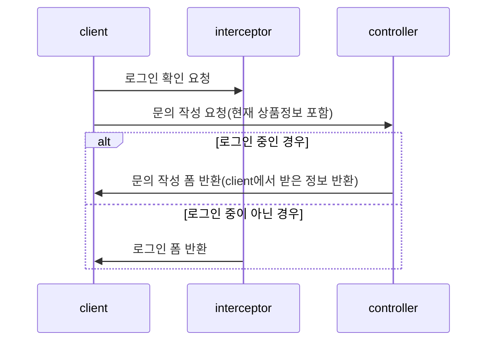
```mermaid
  sequenceDiagram
  client ->> interceptor : 로그인 확인 요청
  client ->> controller : 문의 작성 요청(현재 상품정보 포함)


  alt 로그인 중인 경우
  controller ->> client : 문의 작성 폼 반환(client에서 받은 정보 반환)

  else 로그인 중이 아닌 경우
  interceptor ->> client : 로그인 폼 반환

  end 
```
